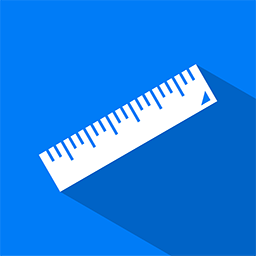

# Quantify.Length 



Quantify.Length makes it easy to work with lengths, when multiple different units are involved.

```csharp
var lengthInKilometers = Length.Create(11.2, Unit.Kilometre);
var lengthInMiles = Length.Create(5, Unit.Mile);

var totalLengthInKilometers = lengthInKilometers + lengthInMiles;
```

For more information about the Quantify framework and what features are available, please see [Quantify](https://github.com/acidicsoftware/dotnet-quantify).

## Length and PreciseLength

Quantify.Length contains two different class for working with lengths.

[Length](src/Quantify.Length/Length.cs) stores the quantity values as a `double`. This means that class is optimized towards performace instead of precision. As a result of this round-off errors might occur.

[PreciseLength](src/Quantify.PreciseLength/PreciseLength.cs) stores the quantity value as a `decimal`, which is optimized towards precision instead of performance. The consequence of this is a slight performance hit when doing calculations, but round-off errors are avoided.

## Supported Units

The following units are supported in the latest version. The units can also be found in [Unit](src/Quantify.Length/Unit.cs).

| SI | Imperial | Typographic  (Planned) | Astronomical (Planned) |
| :--- | :--- | :--- | :--- |
| <ul><li>Yoctometre</li><li>Zeptometre</li><li>Attometre</li><li>Femtometre</li><li>Picometre</li><li>Nanometre</li><li>Micrometre</li><li>Millimetre</li><li>Centimetre</li><li>Decimetre</li><li>Metre</li><li>Decametre</li><li>Hectometre</li><li>Kilometre</li><li>Megametre</li><li>Gigametre</li><li>Terametre</li><li>Petametre</li><li>Exametre</li><li>Zettametre</li><li>Yottametre</li></ul> | <ul><li>Thou</li><li>Inch</li><li>Foot</li><li>Yard</li><li>Chain</li><li>Furlong</li><li>Mile</li><li>League</li><li>Fathom</li><li>Cable</li><li>Nautical Mile</li><li>Link</li><li>Rod</li></ul> |

*© Copyright 2020 Michel Gammelgaard. All rights reserved. Provided under the [MIT license](LICENSE).*
*Ruler icon by Michel Gammelgaard. © Copyright 2020 Michel Gammelgaard. All rights reserved.*